> A: От къде разбрахте за тази позиция?    
> B: Ами написах си един web scraper.   
> ~ my cousin

# Job Market Research Analysis

An in-depth data analysis project exploring modern job listings to identify trends in employment categories, geographic distribution, and the most in-demand technical skills across various sectors.

---

## Project Overview
This repository contains a comprehensive analysis of job market data. By processing thousands of job listings, this research highlights which sectors are growing and which specific skill sets are mandatory for candidates in today’s economy.

## Local Trends (BG)
These high-level visualizations provide an overview of the entire dataset, showing where the jobs are and what they entail.

## Post-project analysis

The data reveals a stark contrast between global developer trends and the localized economic reality of the Bulgarian IT sector. While modern, high-performance languages like Rust dominate international technical discourse, they currently register a 0% presence in the sampled domestic job market (?+ listings), which remains firmly anchored in the "Enterprise Big Three": Java/Spring, .NET/C#, and SQL. The staggering concentration of opportunities in Sofia (exceeding all other cities combined by 13x) coupled with the rise of Remote as the "second largest hub" underscores a market in transition toward flexible, high-density infrastructure roles. Most notably, the "Operations" category outpaces traditional development roles, suggesting that the Bulgarian market has matured into a critical global hub for Site Reliability and Cloud Infrastructure (AWS/Azure) rather than just specialized feature delivery. This analysis confirms that for a developer in this region, the highest "market-fit" is achieved by bridging the gap between legacy enterprise stability and modern containerized deployment (Docker/Linux).

## Job Categories & Locations
I analyzed the distribution of roles to see which industries dominate the current market and where those jobs are physically concentrated.

| Job Categories | Job Locations |
| :---: | :---: |
|  |  |

### Most In-Demand Skills (Overall)
This chart represents the frequency of skill mentions across the entire dataset, regardless of the specific job category.


---

## Skills Analysis by Category
The core of this research breaks down the "Top Skills" required for specific career paths. Below are the visual breakdowns for each major industry sector:

### Development & Software Engineering
* **Full Stack Development:** 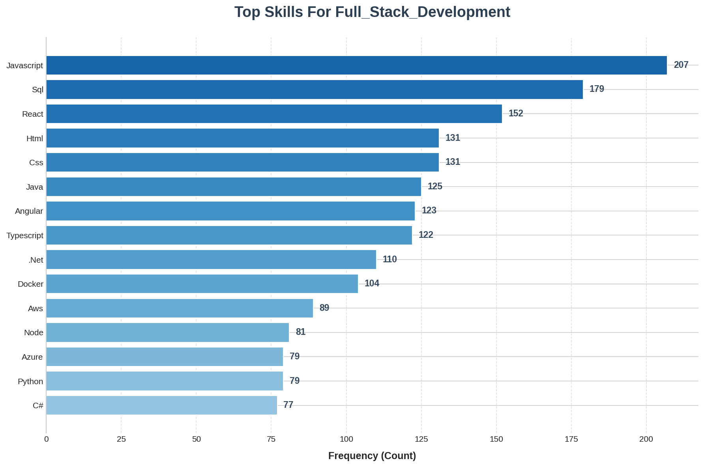
* **Back-End Development:** 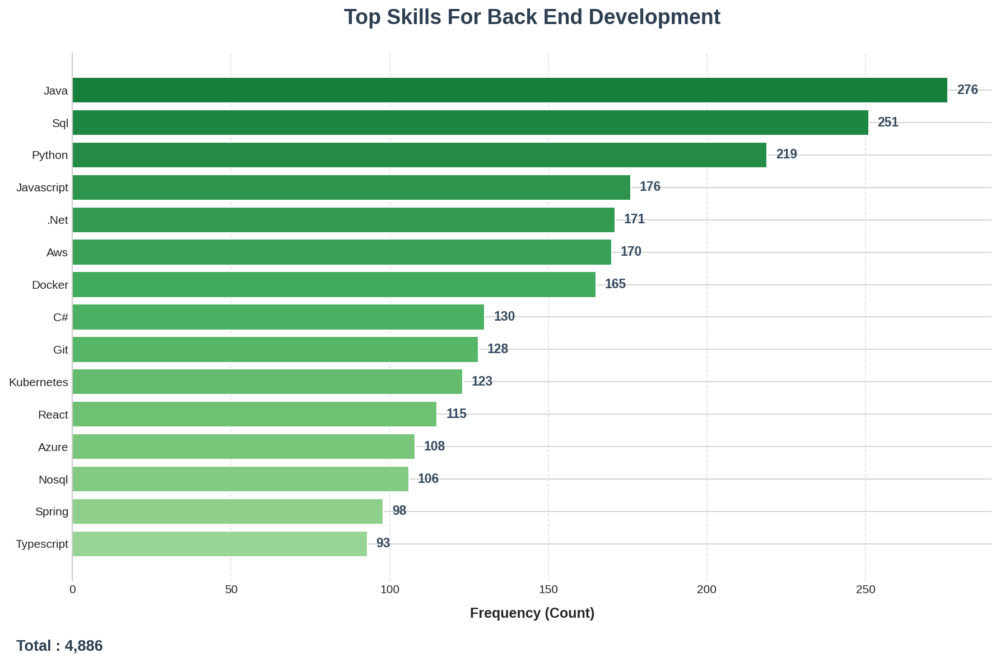
* **Front-End Development:** 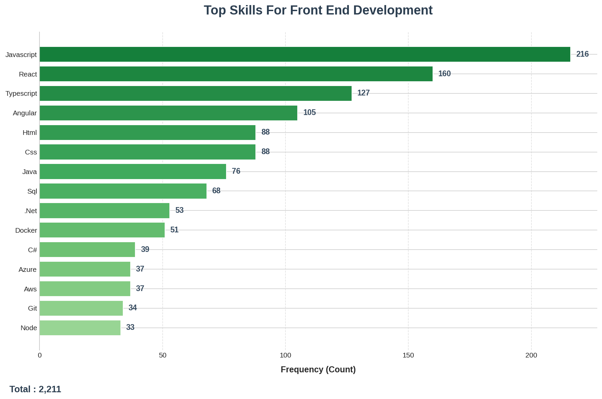
* **Mobile Development:** 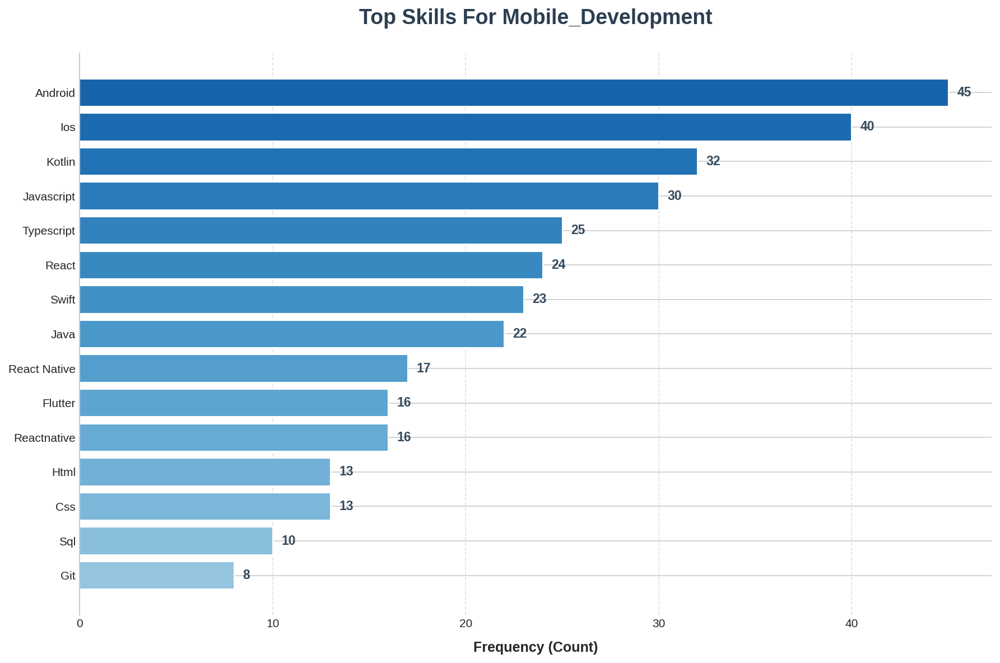
* **Hardware & Engineering:** 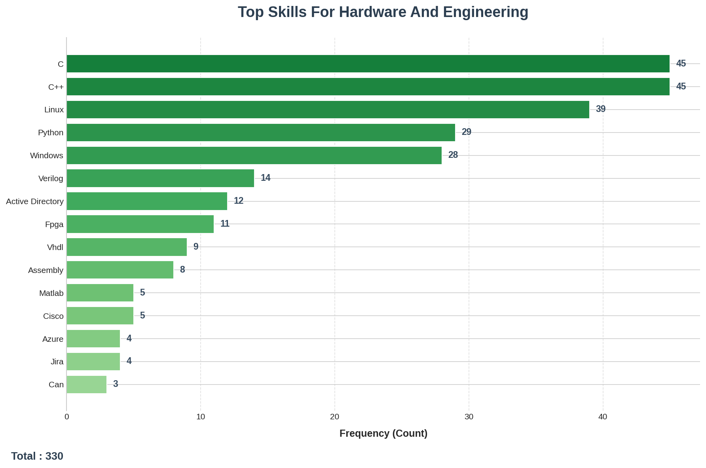
* **Gambling:** 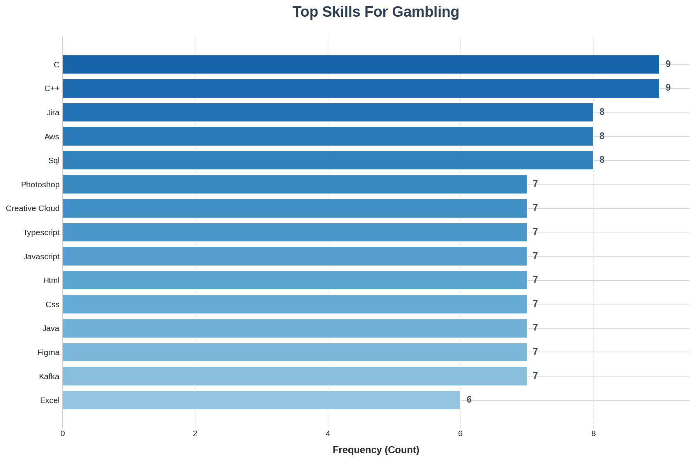

### Data, Design & Specialized Tech
* **Data Science:** 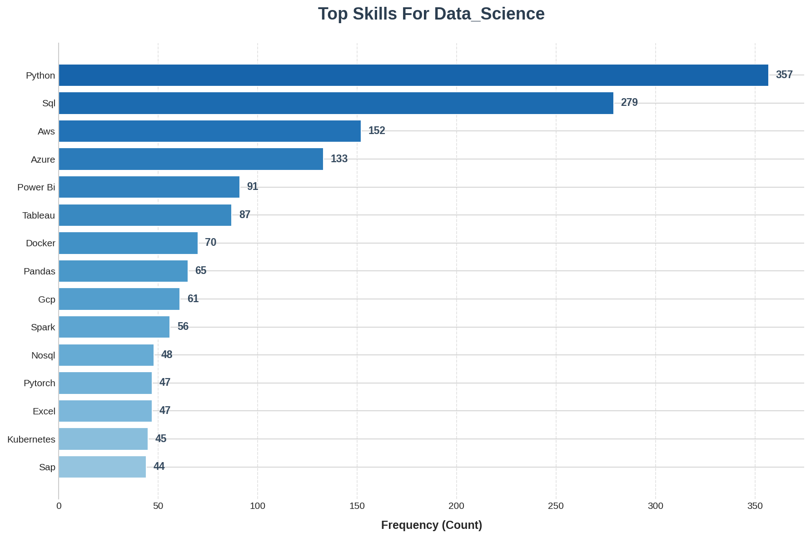
* **UI/UX & Arts:** 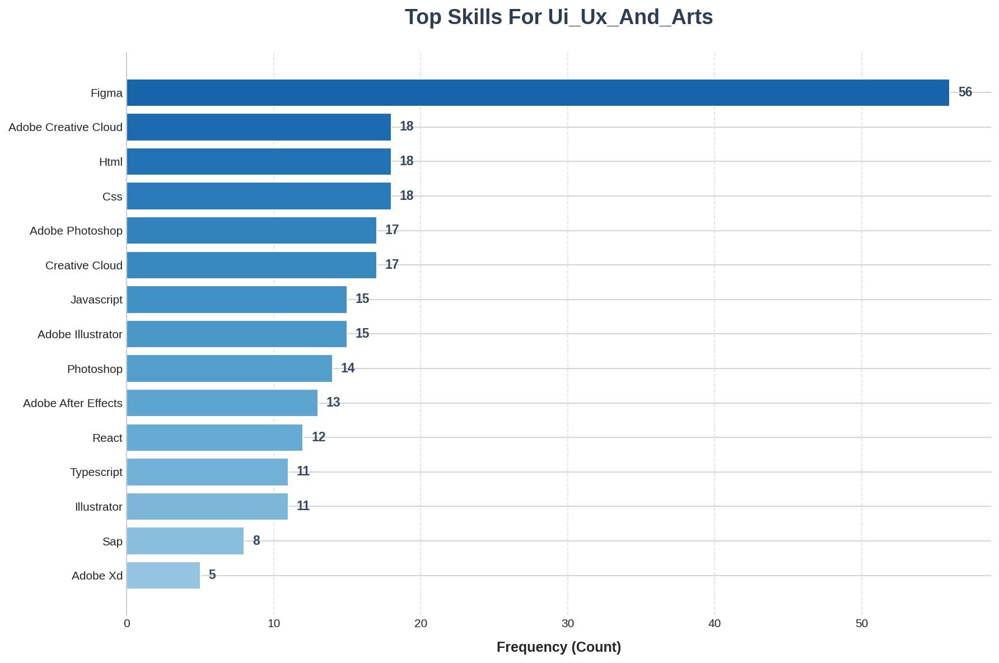
* **ERP/CRM Development:** 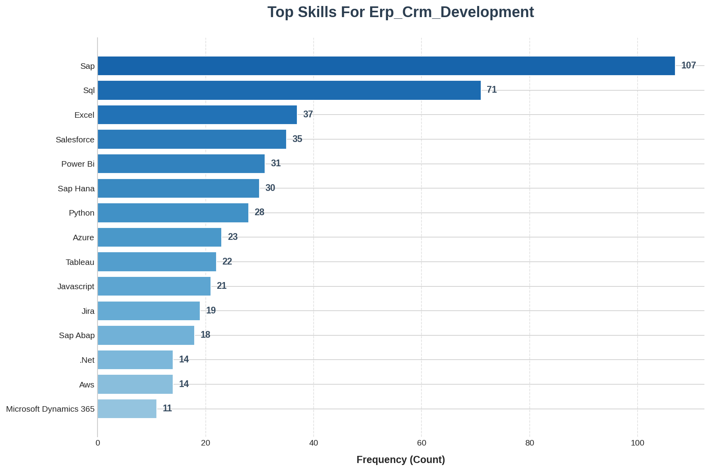

### Operations & Support
* **Operations:** 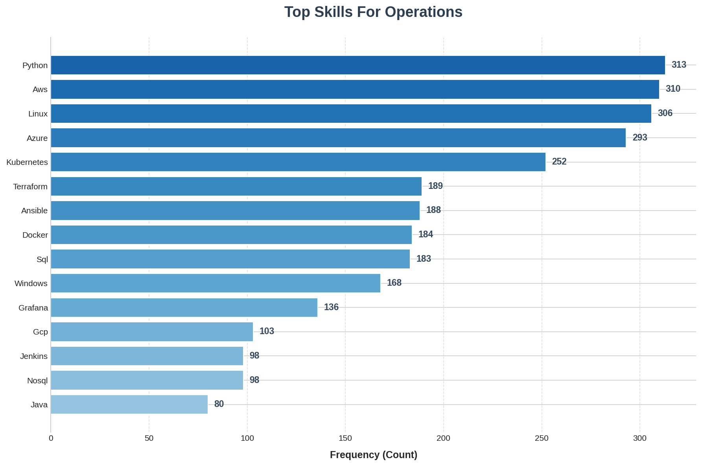
* **Quality Assurance:** 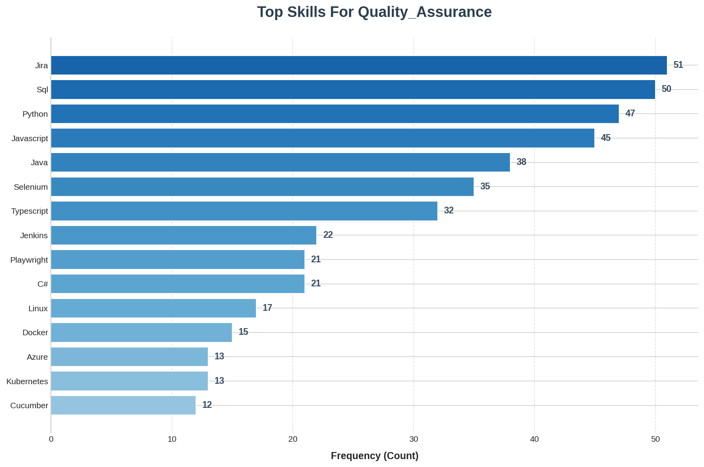
* **Technical Support:** 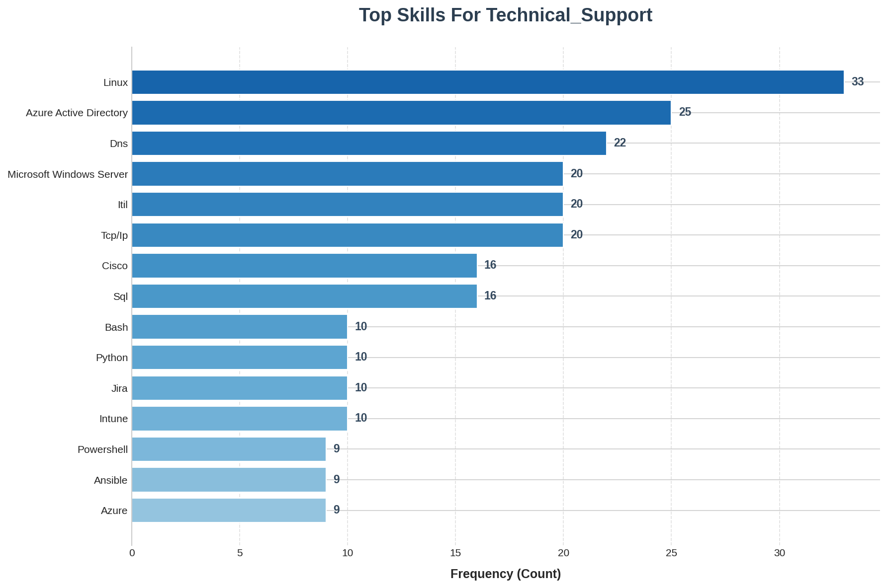
* **Customer Support:** 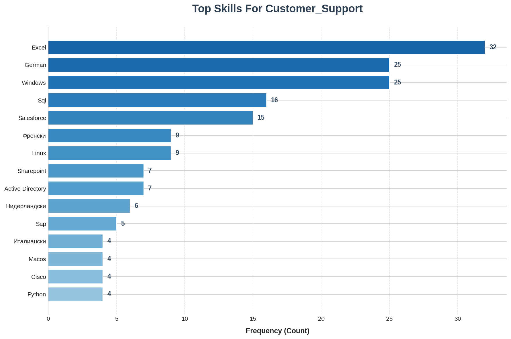
* **PM, BA & More:** 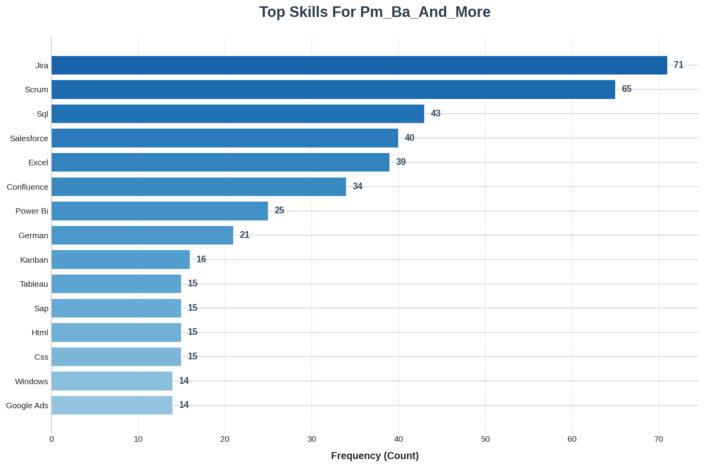

- - -

## 🛠 Methodology
1. **Data Collection:** Data was aggregated from multiple* job boards and listing sites.
2. **Data Cleaning:** Removed duplicate listings, handled missing values, and normalized job titles into standardized categories.
3. **Visualization:** Generated using Python-based libraries (Matplotlib).

## Limitations
* Due to TOS, this information must not be used be sold.   
* The data is only for the Bulgarian programming/tech market.
* I have removed English from all plots, due to it being mandatory in almost all firms

## Working on
1. Better plots

# 🛠 Setup & Execution

## Requirements
* Java 21
* Maven
* Python 3.12
* A modern browser and internet

> These are not minimum requirements, those are the versions I use

## 1. Scraper (dev.bg) (Java/Maven)

Build and run the data collection tool:
```Bash

# Build the project
mvn clean install

# Run the scraper
mvn exec:java -Dexec.mainClass="org.omega.Main"
```


## 3. Scraper (jobs.bg) (JS)

These steps are for Firefox users only. If you are not using Firefox, please search yourself how to install a temporary extention.
The extension works on both platforms, though it is not tested for manifest v3.

Go to `about:debugging#/runtime/this-firefox` and click `Load Temporary Add-on…`. Inside of `firefox_extension` there is a file named `manifest.json`, choose it.   
Then you go to jobs.bg and choose a category you want to scrape through. Scroll down to the bottom of the page and click `Download JSON`.   
Create a folder in the root of the project called `data_2` and place the file with the name of the category. For a list of names, check the head of `generate_stats.py`.
Repeat the stepts for all categories you wish to analysize.


## 3. Plotting (Python)

Process the data and generate the plots:
```Bash

# Create and activate virtual environment
python -m venv venv
source venv/bin/activate  # Windows: venv\Scripts\activate

# Install dependencies
pip install -r requirements.txt

# Generate plots
python generate_stats.py
```


## 📂 Project Structure
  `pom.xml` - Maven configuration.   
  `src/` - Java scraper source code.   
  `generate_stats.py` - Python analysis script.   
  `plots/` - Global trend visualizations.    
  `plots_by_category/` - Sector-specific skill breakdowns.   
  `firefox_extension` - Firefox specific browser extention, could work on Chrome
